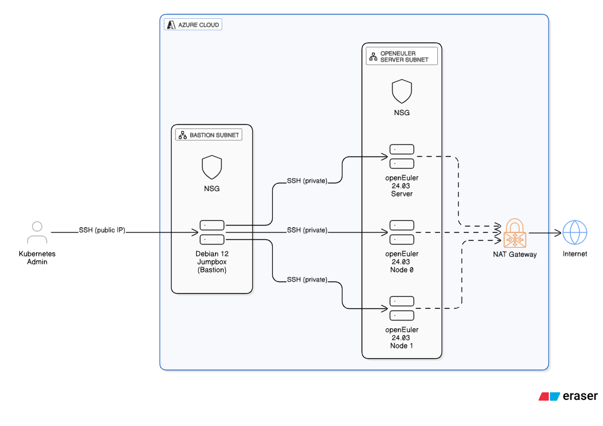
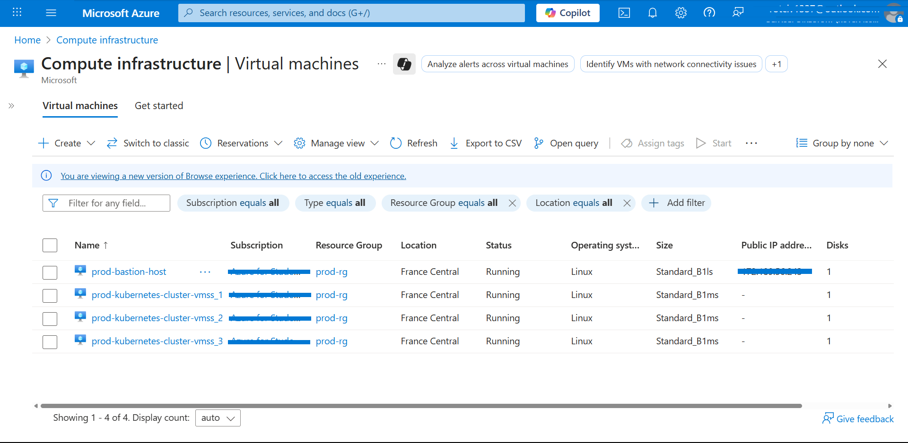
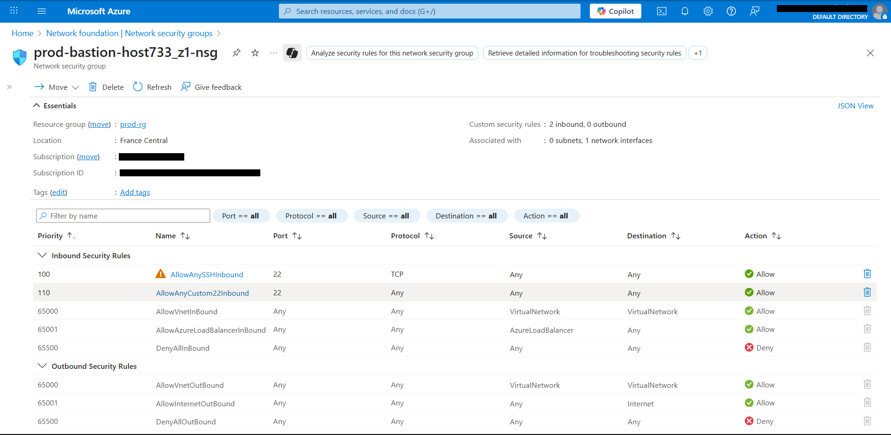
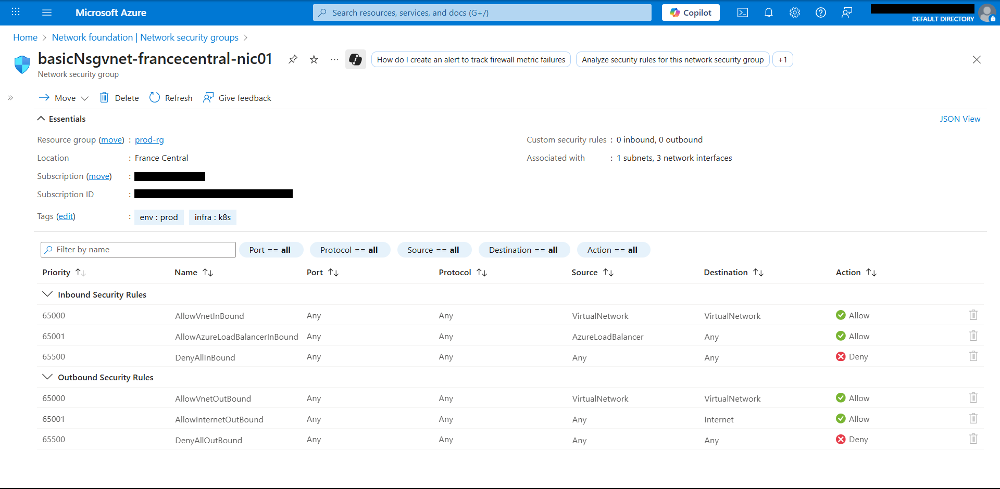
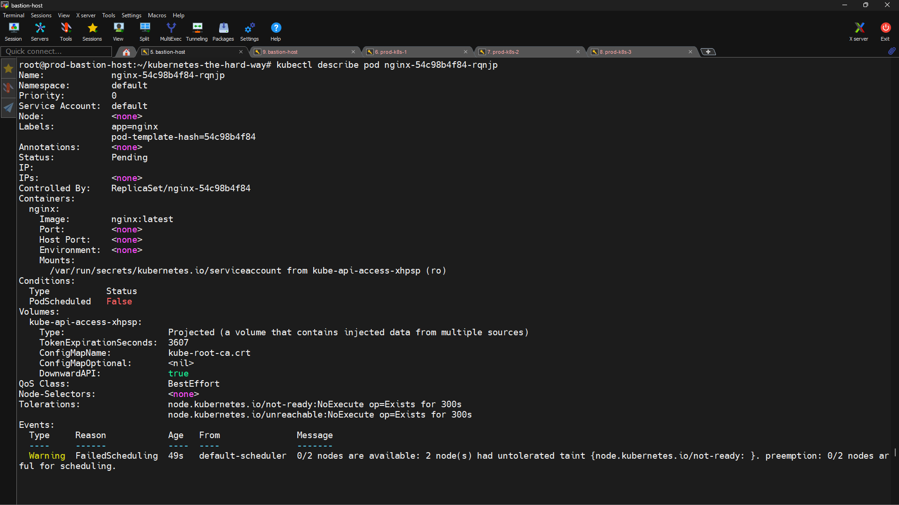
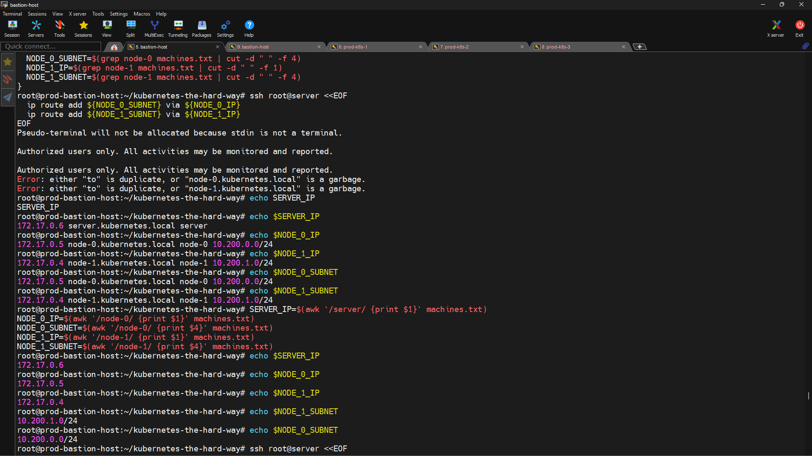
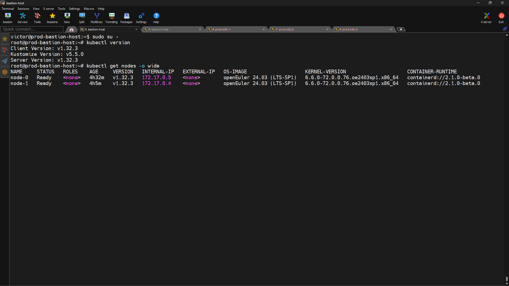
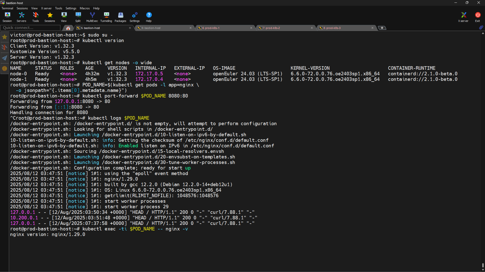

# Deploying Kubernetes on Azure the Hard Way: Securely and Manually with openEuler

## Architecting for Security and Resilience

### Introduction

For any practitioner serious about mastering Kubernetes, [**Kelsey Hightower**](https://www.linkedin.com/article/edit/7361162474290671616/)'s Kubernetes The Hard Way stands as an essential rite of passage. It strips away the abstractions of automated installers and managed services, forcing an engineer to confront the intricate mechanics of bootstrapping a cluster from scratch. This process builds an unshakeable mental model of how each component interacts to form a cohesive, functioning system.

However, the true value of this exercise is revealed not in simply replicating the steps, but in adapting them to a real-world scenario. This article documents such a journey: a customized deployment that moves beyond the standard tutorials environment. The implementation detailed here leverages [**Microsoft Azure**](https://www.linkedin.com/article/edit/7361162474290671616/) as the cloud platform, employs a security-first network architecture with a bastion host, and operates in a heterogeneous environment, combining a [**Debian**](https://www.linkedin.com/article/edit/7361162474290671616/) 12 administrative host with [**openEuler**](https://www.linkedin.com/article/edit/7361162474290671616/) 24.03 for the Kubernetes control plane and worker nodes. This is not merely a recitation of the guide; it is a narrative of architectural design, adaptation to a specific technology stack, and the practical problem-solving required to bring a secure, non-trivial Kubernetes cluster to life.

### The Blueprint for a Secure Cluster

The foundation of any robust Kubernetes deployment is its network architecture. Before a single binary was downloaded, a deliberate design was implemented on Microsoft Azure to enforce a strict security posture, minimizing the clusters attack surface from the outset. This architecture, visualized below, prioritizes isolation and controlled access.


<figcaption>Figure 1: System architecture.</figcaption>

<br>


<figcaption>Figure 2: Compute infrastructure configuration.</figcaption>

<br>

The core principles of this design are:

- **The Bastion Host:** A single Debian 12 virtual machine serves as a hardened bastion host, or "jumpbox." It is the only component in the entire architecture with a public IP address, acting as the sole, authenticated entry point for administrative access via SSH. All subsequent operations to build and manage the cluster are orchestrated from this machine, ensuring that the Kubernetes nodes themselves are never directly exposed to the public internet.
- **Private Subnets:** The Kubernetes components are segregated into an isolated private subnet. This network segmentation prevents lateral movement from the internet and enforces a clear boundary between the cluster's management and workload planes.
- **NAT Gateway:** A critical component for security and functionality is the Azure NAT Gateway. While the Kubernetes nodes have no public IP addresses and cannot receive inbound connections from the internet, they still require outbound access to download package updates and the necessary binaries. The NAT Gateway provides this one-way egress, allowing nodes in the private subnets to initiate connections to the internet while remaining completely shielded from inbound traffic.
- **Network Security Groups (NSGs):** Attached to each subnet, NSGs act as stateful firewalls. They are configured with specific rules to enforce the desired traffic flow, such as allowing SSH traffic into the server and node subnets _only_ from the bastion subnet's private IP range.

<br>


<figcaption>Figure 3: Network security group inbound and outbound rules for the bastion host subnet.</figcaption>

<br>


<figcaption>Figure 4: Network security group inbound and outbound rules for the bastion host subnet.</figcaption>

<br>

### Preparing the Bastion Host

With the architecture in place, the first step was to prepare the Debian 12 bastion host, which would serve as the command center for the entire operation. After logging in, administrative privileges were elevated by switching to the root user, establishing the context for all subsequent setup commands.

The immediate task was to install a suite of essential tools required for the deployment process. The _apt-get_ package manager was used to update the system and install _wget_ and _curl_ for downloading files, _vim_ for editing configurations, _openssl_ for generating cryptographic materials, and git to retrieve the tutorials source repository.
```
{

apt-get update

apt-get -y install wget curl vim openssl git

}
```
With the prerequisites installed, the official workflow began by cloning the kubernetes-the-hard-way repository from GitHub. The _\--depth 1_ flag was used to perform a shallow clone, fetching only the latest commit to minimize download size, as the projects history was not needed.
```
git clone --depth 1 \\

<https://github.com/kelseyhightower/kubernetes-the-hard-way.git>
```
### Assembling the Kubernetes Toolbox

Before any configuration could begin, all the necessary software components had to be gathered on the bastion host. The repository provides a convenient text file, downloads-amd64.txt, which lists the URLs for all the required binaries. This list includes the core Kubernetes components (_kube-apiserver, kube-controller-manager, kube-scheduler, kubelet, kube-proxy, kubectl_), the _etcd_ key-value store, and essential container runtime tools (_containerd, runc, crictl_, CNI plugins).

A single wget command was used to systematically download all of these components into a downloads directory, streamlining the acquisition process.
```
wget -q --show-progress \\

\--https-only \\

\--timestamping \\

\-P downloads \\

\-i downloads-$(dpkg --print-architecture).txt
```
This resulted in a collection of executable binaries and compressed archives totaling over 500 MB. The next step was to organize this collection to facilitate clean and error-free distribution to the various nodes. A script block was executed to create a logical directory structure: client for user-facing tools like _kubectl_, controller for control plane components, worker for node agents, and cni-plugins for the networking binaries. The compressed archives were then extracted directly into their corresponding target directories. This methodical organization is a crucial step that prevents confusion and ensures each node receives only the binaries relevant to its role.
```
{

ARCH=$(dpkg --print-architecture)

mkdir -p downloads/{client,cni-plugins,controller,worker}

tar -xvf downloads/crictl-v1.32.0-linux-${ARCH}.tar.gz \\

\-C downloads/worker/

tar -xvf downloads/containerd-2.1.0-beta.0-linux-${ARCH}.tar.gz \\

\--strip-components 1 \\

\-C downloads/worker/

tar -xvf downloads/cni-plugins-linux-${ARCH}-v1.6.2.tgz \\

\-C downloads/cni-plugins/

tar -xvf downloads/etcd-v3.6.0-rc.3-linux-${ARCH}.tar.gz \\

\-C downloads/ \\

\--strip-components 1 \\

etcd-v3.6.0-rc.3-linux-${ARCH}/etcdctl \\

etcd-v3.6.0-rc.3-linux-${ARCH}/etcd

mv downloads/{etcdctl,kubectl} downloads/client/

mv downloads/{etcd,kube-apiserver,kube-controller-manager,kube-scheduler} \\

downloads/controller/

mv downloads/{kubelet,kube-proxy} downloads/worker/

mv downloads/runc.${ARCH} downloads/worker/runc

}
```
Finally, all binaries were made executable, and _kubectl_ was copied to /usr/local/bin/ to make it available in the systems PATH for convenient use throughout the rest of the setup.

## Public Key Infrastructure (PKI) and kubeconfig Generation

With the software components assembled, the next phase focused on establishing the cryptographic chain of trust for the cluster. In Kubernetes, a robust Public Key Infrastructure (PKI) is non-negotiable. It is the foundation upon which all secure communication rests. Every component, from the API server to the individual kubelets on worker nodes, uses TLS certificates to encrypt traffic and, critically, to authenticate its identity to other components. This system of mutual TLS (mTLS) ensures that, for example, a _kubelet_ can prove it is who it claims to be before the API server accepts its requests, and vice versa.

### Generating the Certificate Authority (CA) 

The root of trust for the entire cluster is a self-signed Certificate Authority (CA). Any certificate signed by this CA will be inherently trusted by all components that are configured to use it. The process began by using _openssl_ to generate a powerful 4096-bit RSA private key (ca.key) and a corresponding self-signed public certificate (ca.crt) with a 10-year (3653 days) validity period. This CA is the most sensitive piece of cryptographic material in the cluster; its compromise would invalidate all cluster security.
```
{

openssl genrsa -out ca.key 4096

openssl req -x509 -new -sha512 -noenc \\

\-key ca.key -days 3653 \\

\-config ca.conf \\

\-out ca.crt

}
```
### Issuing Component Certificates

Once the CA was established, a unique identity was forged for every component in the cluster by issuing it a CA-signed certificate. A for loop was used to automate this repetitive but critical process for the admin user, each worker node (**_node-0_**, **_node-1_**), _kube-proxy_, _kube-scheduler_, _kube-controller-manager_, _kube-api-server_, and the service account mechanism.

This process reveals a fundamental concept in Kubernetes security that The Hard Way brilliantly exposes: certificates are not just for encryption; they are for identity and authorization. The ca.conf configuration file contains specific definitions for each certificates distinguished_name section, which includes the Common Name (CN) and Organization (O) fields. These fields are not arbitrary; they are parsed by Kubernetes internal security mechanisms.

For example, the admin certificate is issued with the Organization field set to system:masters. The Kubernetes RBAC authorizer is hard-coded to recognize the system:masters group as a superuser group with unrestricted, cluster-wide permissions. By embedding this identity into the certificate, a powerful administrative credential is created.

Similarly, the worker node certificates are issued with a Common Name of system:node:lt;nodeNamegt; and an Organization of system:nodes. This specific format is required by the Node Authorizer, a specialized admission controller that grants permissions to kubelets. It authenticates a kubelet by verifying that its certificates CN and O fields match this expected pattern. This ensures that a _kubelet_ for **_node-0_** can only modify API objects related to **_node-0_**, enforcing a powerful security boundary at the node level.

### Creating Secure Access with kubeconfig Files

With certificates in hand, the next step was to create _kubeconfig_ files. A _kubeconfig_ file is a portable YAML file that bundles all the information a client needs to connect and authenticate to the Kubernetes API server. This includes the API servers endpoint address, the clusters CA certificate for trust verification, and the clients own certificate and private key for authentication.

Using a series of _kubectl_ config commands, individual _kubeconfig_ files were generated for each component that needs to communicate with the API server: the _kubelets_ on **_node-0_** and **_node-1_**, _kube-proxy, kube-controller-manager, kube-scheduler_, and the admin user. Each command systematically sets the cluster information (set-cluster), the clients credentials (set-credentials), and binds them together in a context (set-context).

### Secure Distribution of Credentials

The final step in this phase was the secure distribution of these cryptographic assets to their designated nodes. It is a security best practice to ensure that each component has access to only the credentials it requires. Using scp, the certificates and kubeconfig files were meticulously copied to their final destinations:

- The worker-specific certificates (ca.crt, node-0.crt, node-0.key) were placed in /var/lib/kubelet/ on node-0.
- The control plane certificates (ca.key, ca.crt, kube-api-server.key_,_ etc.) were copied to the server node's home directory in preparation for control plane setup.
- The kubeconfig files for the kubelet and kube-proxy were copied to /var/lib/kubelet/ and /var/lib/kube-proxy/ on each respective worker node.
- The kubeconfig files for the control plane components were copied to the server node.

This careful distribution completed the establishment of a secure identity and communication framework for the entire cluster.

## Setting up the Control Plane on openEuler

This phase of the deployment focuses exclusively on the server virtual machine, which is tasked with running the core components of the Kubernetes control plane. This machine, running openEuler 24.03, serves as the cluster's brain.

### Setting up the key-value store: etcd

The first control plane component to be bootstrapped was _etcd_, the consistent and highly-available key-value store used as Kubernetes backing store for all cluster data. The _etcd_ and _etcdctl_ binaries, along with a pre-configured etcd.service systemd unit file, were copied from the bastion host to the server.

Once on the server, a series of setup commands were executed. The binaries were moved to _/usr/local/bin/_ to be in the systems PATH. Directories for _etcd_ configuration (_/etc/etcd_) and data (_/var/lib/etcd_) were created, with strict permissions (_chmod 700_) applied to the data directory. The necessary TLS certificates (ca.crt, kube-api-server.crt, kube-api-server.key) were copied into _/etc/etcd/_ to enable secure, encrypted communication between _etcd_ and the API server. Finally, the _systemd_ service file was moved into place, and the etcd service was enabled and started.

Verification was performed immediately using etcdctl member list, which confirmed that a single-member etcd cluster was started and healthy.

### Securing Data at Rest: Encrypting Secrets

A critical security measure is to ensure that sensitive information, such as Kubernetes Secret objects, is encrypted within _etcd_. To achieve this, an encryption key was generated on the bastion host and used to create an encryption-config.yaml file. This configuration file instructs the Kubernetes API server to use an aescbc provider to encrypt Secret resources before they are written to _etcd_.

This configuration file was then securely copied to the server and later moved to _/var/lib/kubernetes/_, where the API server is configured to find it.

### Bringing the Core Services Online

With _etcd_ running, the remaining control plane components: _kube-apiserver, kube-controller-manager_, and _kube-scheduler_ were brought online. Their binaries, _kubeconfig_ files, and systemd service units were copied to the server.

On the server, a meticulous process of file placement was executed. Each binary was moved to _/usr/local/bin/_. The certificates and the encryption configuration were moved to _/var/lib/kubernetes/_. The kubeconfig files for the controller manager and scheduler were also placed in _/var/lib/kubernetes/_, and the schedulers static configuration YAML was placed in _/etc/kubernetes/config/_. Each components systemd service file was moved to _/etc/systemd/system/_.

With all files in their correct locations, the _systemd daemon_ was reloaded, and all three services were enabled and started in a single command block.
```
{

systemctl daemon-reload

systemctl enable kube-apiserver \\

kube-controller-manager kube-scheduler

systemctl start kube-apiserver \\

kube-controller-manager kube-scheduler

}
```
The first sign of success was immediate. The command **_systemctl is-active kube-apiserver_** returned active, confirming the API server was running. A deeper look into the service logs with **_journalctl -u kube-apiserver_** revealed a healthy startup sequence, with log entries indicating the successful loading of certificates, connection to the _etcd_ backend, and enabling of various API groups.

### Initial Health Checks and Verification

The final step was to verify that the control plane was not only running but also accessible. A kubectl cluster-info command, run locally on the server using the admin.kubeconfig, confirmed that the control plane was listening on the local loopback address as expected.
```
kubectl cluster-info \\

\--kubeconfig admin.kubeconfig
```
The ultimate test, however, was to access the API server from the bastion host, simulating an external administrative connection. A curl command directed at the servers fully qualified domain name (server.kubernetes.local) successfully retrieved the Kubernetes version information, confirming that the API server was up, secure, and externally accessible through the established PKI chain of trust.
```
curl --cacert ca.crt \\

<https://server.kubernetes.local:6443/version>
```
## Expanding the Cluster - Bootstrapping the openEuler Worker Nodes

### Preparing the openEuler Workforce

With the control plane operational, attention turned to bootstrapping the two worker nodes, **node-0** and **node-1**. This stage highlighted a key customization of this deployment: the use of the **_openEuler 24.03_** operating system for the nodes.

### A little bit about the openEuler operating system

[**openEuler**](https://www.openeuler.org/en/) is an open-source Linux distribution optimized for diverse computing architectures, making it a versatile choice for Kubernetes nodes. Its key benefits stem from KubeOS, a container-native OS variant that enables atomic upgrades for enhanced reliability and allows for unified management of the OS and containers directly through Kubernetes. This approach simplifies operations, reduces the attack surface, and improves the overall security and performance of the cluster.

## Continuing the setup

Upon logging into each node, the first command executed was _dnf update_, immediately distinguishing the workflow from Debian-based systems that use _apt_. A set of worker-specific dependencies: _socat_ (for port forwarding), _conntrack-tools_ and _ipset_ (for network rule management by _kube-proxy_), and _kmod_ (for kernel module management) were installed using _dnf_.

A mandatory prerequisite for the kubelet is that swap memory must be disabled. The _swapon --show_ command confirmed no swap was active, and _swapoff -a_ was run to ensure it remained disabled across reboots. Following this, the necessary directory structure for Kubernetes components (_/etc/cni/net.d, /opt/cni/bin, /var/lib/kubelet_, etc.) was created on each node.

## Configuring the Container Runtime and Node Agents

The next step involved distributing and configuring the software that allows a machine to function as a Kubernetes worker node. Using _scp_ from the bastion host, all the binaries previously organized into the worker directory (_containerd, runc, crictl, kubelet, kube-proxy_) and the CNI plugins were copied to each node.

On each node, the binaries were moved to their final locations in the system path. The _containerd_ container runtime was configured by placing its _config.toml_ file and _systemd_ service unit in the appropriate _/etc/_ directories. Similarly, the kubelet and kube-proxy were configured by moving their respective configuration YAMLs, kubeconfig files, and systemd units into place.

To enable the pod network, the b_r_netfilter_ kernel module was loaded using _modprobe_, and kernel _sysctl_ parameters were set to allow bridged traffic to be processed by _iptables_. This is a crucial step for the CNI plugin to function correctly.
```
{

echo "net.bridge.bridge-nf-call-iptables = 1" \\

\>> /etc/sysctl.d/kubernetes.conf

echo "net.bridge.bridge-nf-call-ip6tables = 1" \\

\>> /etc/sysctl.d/kubernetes.conf

sysctl -p /etc/sysctl.d/kubernetes.conf

}
```
With all configurations in place, the final action on each node was to reload the _systemd daemon_ and then start and enable the _containerd, kubelet, and kube-proxy_ services. Seeing the output of _systemctl is-active kubelet_ transition from activating to active marked the successful bootstrapping of the worker node services.

## CNI and Cross-Subnet Routing

### Enabling Pod Networking with CNI

The Container Network Interface (CNI) is the standard by which Kubernetes manages pod networking. In this deployment, the basic bridge and loopback CNI plugins were used. Their configuration files, _10-bridge.conf_ and _99-loopback.conf_, were placed in _/etc/cni/net.d/_ on each worker node. These files instruct the _kubelet_ and _containerd_ on how to create a network namespace for each pod, attach it to a Linux bridge, and assign it an IP address from the nodes allocated pod CIDR range.

### Solving the Multi-Subnet Routing Challenge

Architectural choices have direct, network-level consequences. After the worker nodes were bootstrapped, an initial check with _kubectl get nodes_ revealed a problem: both nodes were reporting a NotReady status. Consequently, when a sample nginx application was deployed, its pod remained stuck in the Pending state. Troubleshooting began with the _kubectl describe pod_ command revealed the reason: 2 node(s) had untolerated taint {node.kubernetes.io/not-ready: }. This indicated a fundamental communication breakdown between the control plane and the kubelets.

<br>


<figcaption>Figure 5: Detecting the node communication issues.</figcaption>

<br>

The root cause lay in the secure, multi-subnet architecture. The pod CIDR ranges assigned to each node (10.200.0.0/24 for **node-0** and 10.200.1.0/24 for **node-1**) are virtual networks managed by the CNI plugin on each host. The underlying Azure virtual network has no inherent knowledge of these pod networks or how to route traffic to them.

The solution was to manually provide this routing information at the operating system level. A series of ip route add commands were executed via SSH on each machine to create the necessary static routes:

- On the server, routes were added to direct traffic for node-0's pod CIDR via node-0's IP, and for node-1's pod CIDR via node-1's IP.
- On node-0, a route was added for node-1's pod CIDR via node-1's IP.
- On node-1, a route was added for node-0's pod CIDR via node-0's IP.

This explicit configuration taught each node how to reach the pod networks on the other nodes, completing the network fabric and enabling full, cluster-wide communication.

### Adapting the scripts: using awk instead of sed

This routing fix also provided a perfect, self-contained example of real-world troubleshooting and the importance of adaptable scripting. The initial attempt to automate the ip route add commands failed. The script used _grep... | cut -d -f 1_ to extract IP addresses from the _machines.txt_ file (which served as the machine database to store the various machine attributes that will be used when setting up the Kubernetes control plane and worker nodes). However, due to the specific formatting of the file, this command incorrectly captured the entire line of text for each variable, not just the IP address or subnet. This caused the _ip route add_ command to fail.

<br>


<figcaption>Figure 6: Adapting the script by changing the sed command to awk.</figcaption>

<br>

Recognizing this parsing failure, the approach was immediately revised. The _cut_ command was replaced with _awk_, a more powerful and flexible tool designed for column-based text processing. The new commands, such as NODE_0_IP=$(awk /node-0/ {print $1} machines.txt), correctly parsed the file, isolating the exact data needed from each column regardless of whitespace variations. Subsequent _echo_ commands confirmed the variables were now correctly populated, and the ip route add commands executed without error.

This pivot from a simple but brittle command to a more robust one demonstrates a key engineering skill: not just following a tutorial, but understanding the intent of a command and selecting the right tool for the job when the environment presents unexpected variations.

## Cluster Validation and Application Deployment

### Achieving the Ready State

With the cross-subnet routing issues resolved and the worker node services restarted, the moment of truth arrived. Executing _kubectl get nodes_ from the bastion host now showed the desired outcome: both **node-0** and node-1 were reporting a Ready status. This confirmed that the control plane could now fully communicate with the _kubelets_, verify their health, and remove the not-ready taint. The cluster was officially operational.

<br>


<figcaption>Figure 7: A fully operational, custom-built Kubernetes cluster on Azure with openEuler nodes.</figcaption>

<br>

### Deploying a Workload

With the nodes ready, the Kubernetes scheduler could now do its job. The nginx deployment, which was previously stuck, was now able to schedule its pod. A quick check with _kubectl get pods_ confirmed that the pod was successfully assigned to a node and had transitioned to the Running state.
```
root@prod-bastion-host:~/kubernetes-the-hard-way# kubectl get pods -l app=nginx

NAME READY STATUS RESTARTS AGE

nginx-54c98b4f84-rqnjp 1/1 Running 0 7m21s
```
### Verifying Full Functionality

A final series of tests was conducted to perform an end-to-end validation of the clusters core capabilities.

- Pod Operations: Standard _kubectl_ commands were used to interact with the running nginx pod. _kubectl logs_ successfully retrieved the containers logs, _kubectl exec_ was used to run a command (_nginx -v_) inside the container, and _kubectl port-forward_ established a direct connection to the pod for local testing. All commands executed successfully, validating pod lifecycle management and interaction.
- Service Networking: The ultimate test was to validate the clusters service discovery and networking layers. The nginx deployment was exposed as a _NodePort_ service, which instructs _kube-proxy_ on each node to open a specific port and forward traffic to the nginx pod. The assigned _NodePort_ was retrieved, and a curl request was sent from the bastion host to one of the worker nodes on that port. The HTTP/1.1 200 OK response confirmed that the entire service networking stack was fully functional.

<br>


<figcaption>Figure 8: Running pod operations and service networking tests.</figcaption>

<br>

## Conclusion

### The True Value of the 'Hard Way'

This journey through a customized deployment of "Kubernetes The Hard Way" underscores the profound educational value of the exercise. The objective is not to produce a production-ready cluster but to forge a deep, intuitive understanding of the system's architecture and operational mechanics. By deliberately choosing a non-standard, security-focused environment on Microsoft Azure with openEuler nodes, the process moved beyond simple replication into the realm of practical systems engineering.

The experience yielded several key lessons.

- First, it provided a tangible application of security-in-depth principles in a cloud context, demonstrating how network segmentation, bastion hosts, and controlled egress create a hardened posture.
- Second, it highlighted the nuances of working in a heterogeneous Linux environment, requiring adaptation from apt to dnf and an awareness of OS-level configurations.
- Finally, and most importantly, it forced hands-on troubleshooting of real-world problems, from adapting shell scripts with awk to solve a parsing issue, to diagnosing and fixing a network routing problem caused by the multi-subnet architecture.


It is in these moments of diagnosis and resolution that true learning occurs. Mastering these fundamentals is what elevates a practitioner from a tool user to a systems engineer, and there is no more effective path to that mastery than building it, piece by piece, the hard way.

